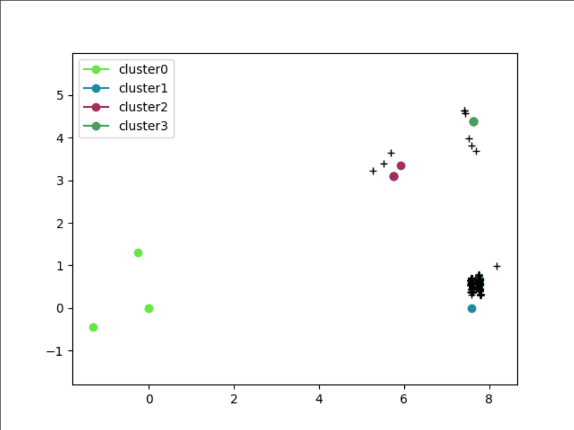

# Fingerprinter

This project aims to improve usability of the library hfinger https://github.com/CERT-Polska/hfinger
The main goal is to reuse functions (with improvements) to generate fingerprints from json keys.

# To date

There is two entry points.
_hfingerprinter.py_ reads a pcap, filters usable HTTP request through Tshark and output a list of fingerprints in a txt file. Everything is logged if the parameter is set.

_sortfingerprint.py_ reads a fingerprint list and build clusters of fingerprint using machine learning depending on a given threshold. Each cluster is grouped by an algorithm which calculate distances between every fingerprints (can be displayed). 


# Entry points
## Hfinger

Research were made on how hfinger process pcap, functions were used one by one to decompose behavior :

1. Init logger
2. Parse args
3. Run tshark and output to json
4. Fix tmp json if needed
5. Read json > format keys
6. Call functions to hash infos
7. Return a whole line

### Development

- pcap fingerprinting
    - [ ] Multithread 
    - [x] Handle errors and pursue process
- json entry
    - [x] Check legitimacy of entry first
    - [x] Read needed keys
    - [x] Format for usability
    - [x] Process

### Usage example
> hfingerprinter.py -f files/onlyhttp.pcap -ot out -l test

> sortfingerprint.py files/legitimeFirefox files/legitimeFirefox2 files/wannaCry

## Graph display
This part is built to get a graphical representation of fingerprints. It takes in parameter a JSON reference to place clusters, and another JSON array or arrays to place fingerprints. 

The goal is to give an idea of distances between every fingerprint given.

The first JSON place points for each cluster with a random color as a reference, the second JSON represent the fingerprints generated by a user and represented as black crosses. The last one is the actual evaluated result of the navigation of a user. 



### How it works
No library is used but maths. The first ever fingerprint _A_ is given the coordinates {0,0} as a base, the second fingerprint _B_ is given the distance between these two points {?, 0}.

To place a _C_ point, this one will need to contain both distances to _A_ and _B_. Roughly, trying to place C with _AC_ and _BC_ distances, the point can only be at top or bottom from the horizontal _AB_. 
In this code, _C_ will always be on top. Each point follow the same process.

```
{cx, cy}

cx^2+cy^2==ac^2 && (cx-ab)^2+cy^2==bc^2

=> cx^2-(cx-ab)^2==ac^2-bc^2
=> 2*cx*ab==ac^2-bc^2+ab^2

=> cx = (ac^2-bc^2+ab^2)/(2*ab)

=> cy = +/- sqrt(ac^2-cx^2)   iff ac^2-cx^2 > 0
=> cy = 0   iff ac^2-cx^2 = 0
=> else no solution
```

### Usage example
> display/doGraph.py -f superJson.json -p listPoints.json

### GIF
You may clone the _GIF_ Github branch in order to generate a moving graph. For each user fingerprint (black cross) an image is generated. They will eventually be added to form a queue and generate a GIF.


Note that this process takes ages to run and could be improved.